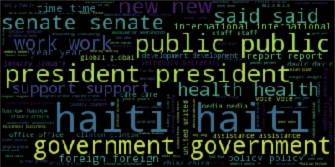
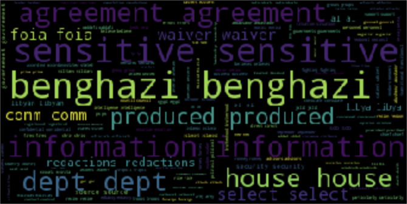
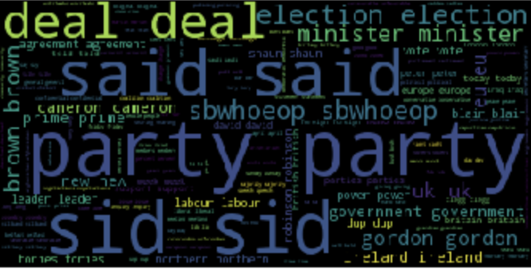
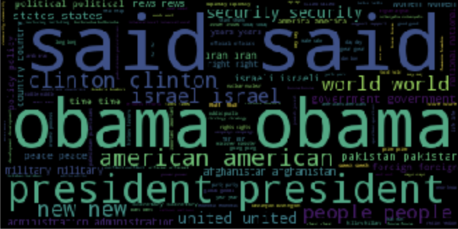

# TopicModelingClintonEmails

My attempt at using natural language processing techniques such as Latent Dirichlet Allocation to 
perform topic modeling on a public dataset of Clinton emails.

## Wordclouds for Topics Discovered

### Topic 0: Haiti Earthquake and the Clinton Foundation

### Topic 1: Benghazi Controversey

### Topic 2: Correspondence with Sidney Blumenthal, a former Bill Clinton aide and journalist

### Topic 3: Correspondence with Huma Abedin, a senior aide to Hillary Clinton

### Topic 4: The Obama Administration and the 2016 Election

